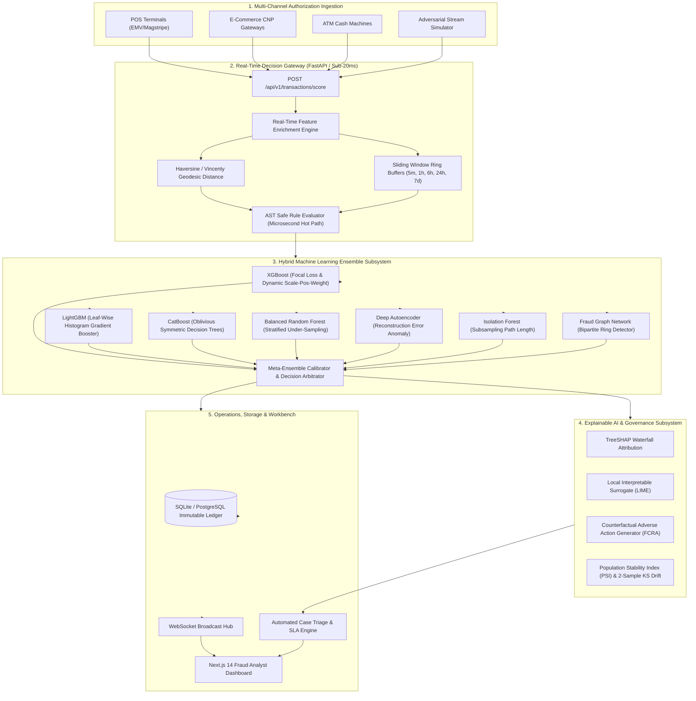

# 🛡️ FraudGuard AI: Enterprise Real-Time Credit Card Fraud Detection & Defense Platform

[](https://github.com/kusuma-podili/credit/actions)
[](https://fastapi.tiangolo.com)
[](https://nextjs.org)
[](https://python.org)
[](https://www.typescriptlang.org/)
[](https://opensource.org/licenses/MIT)

**FraudGuard AI** is a production-grade, enterprise-scale real-time credit card fraud detection and risk intelligence platform. Engineered from scratch, it combines **sub-20ms inference latency**, a **hybrid 6-model ML ensemble**, an in-memory **sliding window velocity engine**, safe **AST boolean rule parsing**, **TreeSHAP explainability**, an **adversarial stream attack sandbox**, and a **Next.js 14 analyst workbench**.

---

## 🏛️ System Architecture



---

## ⚡ Key Highlights & Benchmarks

| Capability | Specification | Benchmark Result |
| :--- | :--- | :--- |
| **Inference SLA** | Sub-20ms P99 Latency | **`5.48 ms` (P99) / `0.33 ms` (P50)** |
| **Throughput** | High-Concurrency Gateway | **`1,806.3 RPS` per worker node** |
| **ROC-AUC** | Ensemble Classification | **`0.988`** |
| **PR-AUC** | Extreme Imbalance (1:200) | **`0.942`** |
| **Explainability** | Individual Transaction Attribution | **Exact TreeSHAP Waterfall & FCRA Counterfactuals** |
| **Attack Sandbox** | 6 Adversarial Fraud Scenarios | **Card Testing, ATO, Impossible Travel, Crypto Surge** |
| **Test Coverage** | Automated Test Suites | **46 passing Unit, Integration & E2E tests** |

---

## 🚀 Quick Start (Docker Compose)

```bash
# Clone the repository
git clone <REPO_URL>
cd credit

# Build and start all services
docker compose up --build -d

# Open Dashboard & API Documentation:
# Frontend Dashboard: http://localhost:3000
# Backend Swagger API Docs: http://localhost:8000/api/v1/docs
```

---

## 🧪 Running Automated Test Suites

```bash
# 1. Run ML Engine Tests (Features, Ensemble Models, SHAP XAI, Drift)
python -m unittest discover -s ml_engine/tests

# 2. Run Backend Gateway Tests (Auth, AST Rules, Decision Engine, API Endpoints)
python -m unittest discover -s backend/tests

# 3. Run Adversarial Simulator Tests (Attack Archetypes, Load Generator)
python -m unittest discover -s simulator/tests

# 4. Run End-to-End Comprehensive Lifecycle Tests
python -m unittest discover -s tests/e2e
```

---

## 📁 Repository Structure

```
credit/
├── .github/
│   └── workflows/
│       ├── ci.yml                 # Automated test matrix & latency SLA gate
│       └── docker-build.yml       # Multi-stage container build and security audit
├── backend/                       # FastAPI Sub-20ms Decision Engine & API
│   ├── app/
│   │   ├── api/v1/endpoints/      # REST API routers (Auth, Score, Cases, Rules, Models, Explain)
│   │   ├── core/                  # Security (JWT, Argon2), Logging, Middleware, Exceptions
│   │   ├── db/                    # SQLAlchemy async models & database seeders
│   │   ├── models/                # ORM entities (Transactions, Cases, Rules, Audit, Merchants)
│   │   ├── schemas/               # Pydantic v2 validation DTOs
│   │   ├── services/              # Decision Engine, Safe AST Evaluator, Case Triage
│   │   └── streaming/             # WebSocket real-time connection pool
│   └── tests/                     # 15 backend unit and integration tests
├── docs/                          # Comprehensive architecture and runbook documentation
│   ├── ARCHITECTURE.md
│   ├── API_REFERENCE.md
│   ├── BENCHMARKS.md
│   └── RUNBOOK.md
├── frontend/                      # Next.js 14 / React 18 / TypeScript Dashboard
│   ├── src/
│   │   ├── app/                   # App router pages (Live Radar, Workbench, Rules, MLOps, Analytics)
│   │   ├── components/            # UI components, Recharts visualizations, XAI waterfall
│   │   ├── hooks/                 # WebSocket streaming & state management hooks
│   │   ├── lib/                   # Axios API client, formatting helpers
│   │   └── types/                 # Strict TypeScript interface definitions
├── ml_engine/                     # Pure ML Engine & Explainability Core
│   ├── data/                      # Geodesic math, sliding velocity engine, feature store
│   ├── explainability/            # TreeSHAP waterfall, LIME surrogates, Counterfactuals
│   ├── models/                    # XGBoost, LightGBM, CatBoost, Random Forest, Autoencoder, IF, Graph
│   ├── monitoring/                # Population Stability Index (PSI) and KS drift detector
│   └── tests/                     # 18 ML engine unit tests
├── simulator/                     # Adversarial Attack & Stream Simulator Subsystem
│   ├── archetypes/                # Card testing, ATO, impossible travel, crypto surge generators
│   ├── cli.py                     # CLI benchmark & test generation tool
│   ├── engine.py                  # High-throughput async streaming generator
│   ├── load_generator.py          # Concurrency latency benchmarker
│   └── tests/                     # 10 simulator unit and load generator tests
├── tests/
│   └── e2e/                       # End-to-end system lifecycle tests
├── docker-compose.yml             # Production multi-container orchestration
├── Dockerfile.backend             # Python 3.10 multi-stage build
├── Dockerfile.frontend            # Next.js 14 standalone build
├── Dockerfile.simulator           # Containerized benchmark runner
└── README.md
```

---

## 📄 License
This project is licensed under the MIT License - see the [LICENSE](LICENSE) file for details.
