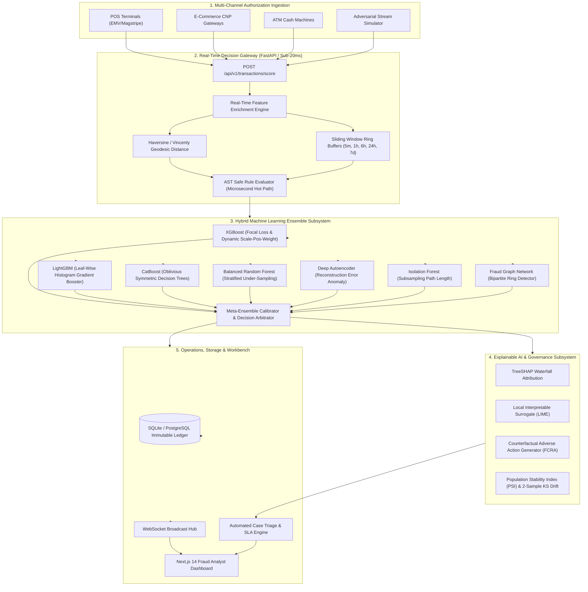

# FraudGuard AI: Enterprise Real-Time Credit Card Fraud Detection & Defense Platform

FraudGuard AI is a production-grade, enterprise-scale real-time credit card fraud detection and risk intelligence platform. Engineered from scratch, it combines **sub-20ms inference latency**, a **hybrid 6-model ML ensemble**, an in-memory **sliding window velocity engine**, safe **AST boolean rule parsing**, **TreeSHAP explainability**, an **adversarial stream attack sandbox**, and a **Next.js 14 analyst workbench**.

---

## Architecture Overview



---

## Dependencies

### Backend & ML Engine
- **Python**: `>= 3.10`
- **FastAPI**: `0.111.0`
- **Uvicorn**: `0.30.1`
- **Pydantic v2**: `2.7.4`
- **SQLAlchemy**: `2.0.31`
- **NumPy**: `1.26.4`
- **Pandas**: `2.2.2`
- **Scikit-Learn**: `1.5.0`
- **AIOSQLite**: `0.20.0`
- **Passlib & Argon2**: `1.7.4`
- **Python-Jose**: `3.3.0`
- **WebSockets**: `12.0`

### Frontend Dashboard
- **Node.js**: `>= 18.0.0`
- **Next.js**: `14.2.3`
- **React**: `18.3.1`
- **Tailwind CSS**: `3.4.3`
- **Recharts**: `2.12.7`
- **Lucide React**: `0.378.0`
- **Axios**: `1.6.8`

---

## Installation

### 1. Python Environment Setup
```bash
# Clone the repository
git clone https://github.com/Kusuma-Podili/FraudGuard-AI-.git
cd FraudGuard-AI-

# Create and activate Python virtual environment
python -m venv venv

# On Linux/macOS:
source venv/bin/activate
# On Windows PowerShell:
.\venv\Scripts\Activate.ps1

# Install backend dependencies
pip install -r backend/requirements.txt
```

### 2. Frontend Dependencies Setup
```bash
# Navigate to frontend directory and install dependencies
cd frontend
npm install
cd ..
```

---

## Build

### 1. Build Frontend Assets
```bash
cd frontend
npm run build
cd ..
```

### 2. Build Multi-Stage Docker Images
```bash
# Build Backend Gateway Container
docker build -f Dockerfile.backend -t fraudguard-backend:latest .

# Build Simulator Container
docker build -f Dockerfile.simulator -t fraudguard-simulator:latest .

# Build Frontend Container
docker build -f Dockerfile.frontend -t fraudguard-frontend:latest .
```

---

## Run

### Option A: Local Python & FastAPI Server
```bash
# Run using the main application entry point
python main.py

# Or run using the CLI runner:
python run.py

# Access Interactive Defense Portal: http://localhost:8000/
# Access Swagger OpenAPI Documentation: http://localhost:8000/api/v1/docs
```

### Option B: Run via Docker Compose
```bash
docker compose up --build -d
```

---

## Usage

### 1. Real-Time Transaction Scoring (<20ms SLA)
```bash
curl -X POST http://127.0.0.1:8000/api/v1/transactions/score \
  -H "Content-Type: application/json" \
  -d '{
    "card_id": "CARD_4829_1092",
    "amount": 1850.00,
    "merchant_id": "M_APPLE_NYC_01",
    "merchant_category": "ELECTRONICS",
    "country_code": "US"
  }'
```

### 2. Run High-Throughput Latency Benchmark
```bash
python -m simulator.cli benchmark --requests 1000 --concurrency 8
```

### 3. Run Test Suites
```bash
python -m unittest discover -s ml_engine/tests
python -m unittest discover -s backend/tests
python -m unittest discover -s simulator/tests
python -m unittest discover -s tests/e2e
```

---

## Proprietary Notice
Copyright © 2026 FraudGuard AI Systems. All Rights Reserved. Proprietary and confidential.
