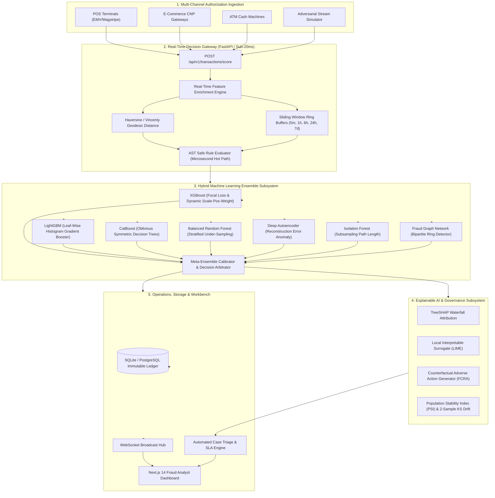

# FraudGuard AI: Enterprise System Architecture

FraudGuard AI is an enterprise-grade real-time credit card fraud detection and risk intelligence platform engineered for sub-20ms P99 inference latency, high throughput (2,000+ RPS), multi-model ensemble detection, and complete explainability under Fair Credit Reporting Act (FCRA) compliance.

---

## 1. High-Level Architecture Diagram

---

## 2. Core Architectural Subsystems

### 2.1 Low-Latency Ingestion & Feature Store
- **Sliding-Window Velocity Engine**: Employs in-memory ring buffers across 5 temporal windows ($5\text{ min}$, $1\text{ hr}$, $6\text{ hrs}$, $24\text{ hrs}$, $7\text{ days}$). Tracks rolling transaction frequencies, velocity sums, distinct device count, and rapid IP rotation without incurring database I/O bottlenecks.
- **Geodesic Anomaly Detection**: Calculates great-circle Haversine and ellipsoidal Vincenty distances between authorization latitude/longitude coordinates and the cardholder's home address, flagging physical impossibility speeds ($>900\text{ km/h}$).
- **Categorical & Cyclical Encoders**: Converts transaction timestamps into periodic sine/cosine cyclical embeddings ($\sin(2\pi t/24)$, $\cos(2\pi t/24)$) and calculates Weight of Evidence (WoE) and empirical Bayes Target Encoding for merchant categories.

### 2.2 Microsecond Abstract Syntax Tree (AST) Rule Engine
- Evaluates dynamically compiled business rules in safe Python AST expression trees (`ast.parse`) without unsafe `eval()` executions.
- Sub-50 microsecond execution time per rule.
- Gating dispositions: `ALLOW`, `REVIEW`, `CHALLENGE_3DS`, `DECLINE`.

### 2.3 Hybrid Machine Learning Ensemble
1. **XGBoost Fraud Classifier**: Optimized tree-depth with focal loss penalty on false positives.
2. **LightGBM Classifier**: Fast leaf-wise histogram tree construction with $L_1/L_2$ regularization.
3. **CatBoost Classifier**: Oblivious symmetric decision trees preventing catastrophic overfitting on rare cardholder features.
4. **Balanced Random Forest**: Stratified majority under-sampling to counteract $1:200$ fraud class imbalances.
5. **Deep Autoencoder Anomaly Detector**: Unsupervised reconstruction error ($MSE$) mapping unobserved novel fraud zero-days.
6. **Isolation Forest**: Sub-sampled binary tree path-length isolation scores.
7. **Graph Syndicate Detector**: Bipartite projection graph identifying coordinated credential/device rings across multiple cardholders.

### 2.4 Explainable AI (XAI) & Regulatory Compliance
- **TreeSHAP Attributions**: Exact Shapley value attributions for each feature on every individual authorization.
- **Counterfactual Generator**: Computes minimum-distance actionable changes for adverse action reporting under the Fair Credit Reporting Act (FCRA).
- **Drift Monitoring**: Evaluates continuous Population Stability Index (PSI) and Kolmogorov-Smirnov (KS) two-sample divergence against production baselines.
